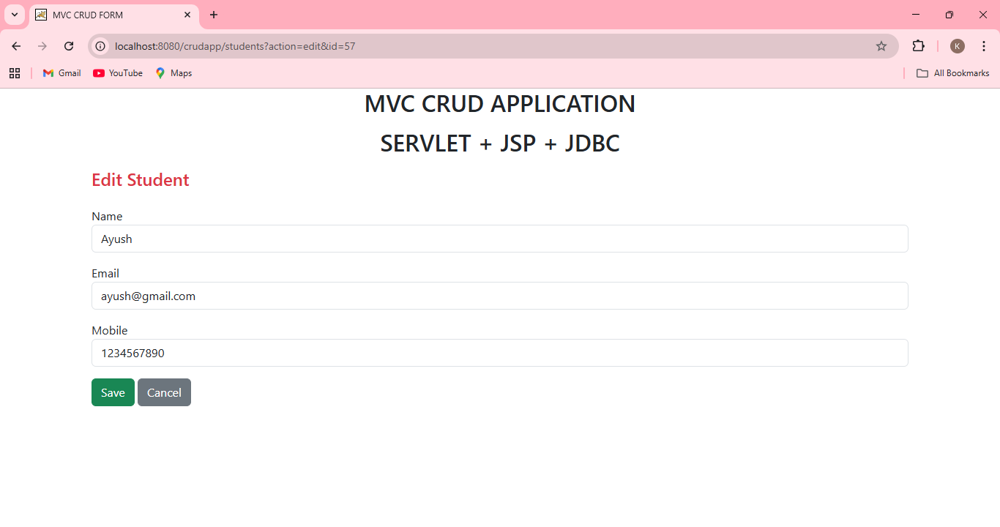
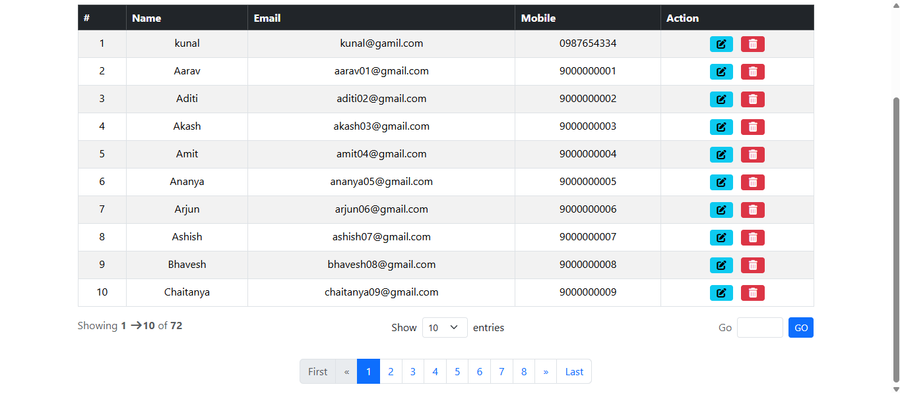
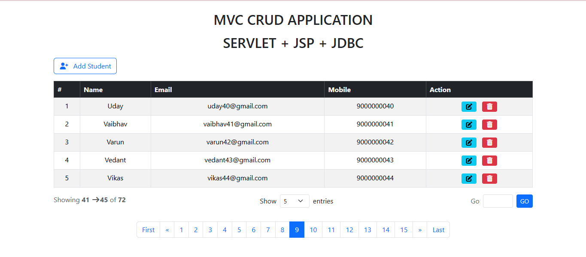
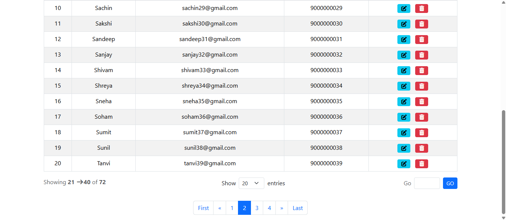

# MVC Student Manager

[](https://www.oracle.com/java/technologies/javase/jdk17-archive-downloads.html)
[](https://jakarta.ee/specifications/servlet/)
[](https://jakarta.ee/specifications/pages/)
[](https://www.postgresql.org/)
[](https://tomcat.apache.org/)
[](https://getbootstrap.com/)
[](LICENSE)

A **Student Management CRUD application** built using **Java MVC architecture**, following clean separation of concerns, validation, centralized exception handling, and scalable UI design.

---

## Features ✨

### v1.0 – Core CRUD

* Add Student
* View Student List
* Edit Student
* Delete Student
* Client-side validation (HTML5)
* Server-side validation (Servlet)
* Centralized error handling (`DAOException`)
* Clean Bootstrap-based UI

### v1.1 – Enhanced UX & Scalability

* Pagination for student listing
* Reusable navigation bar
* Improved UI consistency
* Better user navigation flow
* Pagination model abstraction

---

## New Features 🆕

* Pagination support using a dedicated `Pagination` model
* Common navigation bar across all pages
* Cleaner page transitions and navigation flow
* Improved scalability for large datasets

---

## Git Hygiene 🧹

This project follows **clean Git practices** to maintain readability and collaboration quality:

* Meaningful commit messages (`feat`, `fix`, `docs`, `refactor`)
* Logical commits for each feature or fix
* No unnecessary files committed
* Clear version progression (`v1.0` → `v1.1`)
* Organized project and resource structure

---

## Tech Stack 🛠️

| Layer           | Technology                    |
| --------------- | ----------------------------- |
| Frontend (View) | JSP, HTML5, CSS3, Bootstrap 5 |
| Controller      | Jakarta Servlet API           |
| Backend         | Java 17                       |
| Database Access | JDBC                          |
| Database        | PostgreSQL                    |
| Server          | Apache Tomcat 11              |
| Build Tool      | Maven                         |
| Architecture    | MVC                           |
| Version Control | Git & GitHub                  |

---

## Project Structure 📂

```
java-crud-mvc-playground
│
├── screenshots
│   ├── v1.0
│   └── v1.1
│
├── src
│   └── main
│       ├── java
│       │   └── com.kagrawal.crudapp
│       │       ├── dao
│       │       │   ├── StudentDAO.java
│       │       │   └── StudentDAOImpl.java
│       │       │
│       │       ├── Exception
│       │       │   └── DAOException.java
│       │       │
│       │       ├── model
│       │       │   ├── Student.java
│       │       │   └── Pagination.java
│       │       │
│       │       ├── utils
│       │       │   └── JDBCUtils.java
│       │       │
│       │       └── web
│       │           └── StudentServlet.java
│       │
│       └── resources
│
├── src/main/webapp
│   ├── student-list.jsp
│   ├── student-form.jsp
│   ├── error.jsp
│
└── README.md
```

---

## Architecture Overview 🏗️

The application follows the **Model–View–Controller (MVC)** pattern:

* **Model** → `Student`, `Pagination`
* **DAO** → Database operations using JDBC
* **Controller** → `StudentServlet`
* **View** → JSP pages with Bootstrap UI

---

## Database Schema 🗄️

```sql
CREATE TABLE student (
    id SERIAL PRIMARY KEY,
    name VARCHAR(50) NOT NULL,
    email VARCHAR(100) NOT NULL,
    mobile VARCHAR(10) NOT NULL
);
```

---

## Configuration ⚙️

Update database credentials in `JDBCUtils.java`:

```java
private static final String URL  = "jdbc:postgresql://localhost:5432/studentdb";
private static final String USER = "postgres";
private static final String PASS = "password";
```

---

## Screenshots 📸

### Version v1.0 – Core CRUD

| Feature          | Preview                                                    |
| ---------------- | ---------------------------------------------------------- |
| Student List     |  |
| Add Student      |   |
| Edit Student     |  |
| Validation Error |    |
| Error Page       |         |

---

### Version v1.1 – Pagination & Navigation

| Feature        | Preview                                                      |
| -------------- | ------------------------------------------------------------ |
| Pagination     |      |
| Navigation Bar |          |
| Paginated List |  |

---

## How to Run ▶️

1. Clone the repository

```bash
git clone https://github.com/kunal-agr/crudapp.git
```

2. Create database

```sql
CREATE DATABASE studentdb;
```

3. Import as Maven project in IDE
4. Configure Apache Tomcat 11
5. Run and access:

```
http://localhost:8080/<project-context>
```

---

## Purpose 🎯

This project was built to practice **MVC architecture**, **CRUD operations**, **pagination**, **validation**, and **professional UI structuring** following industry-level standards.

---

## License 📄

This project is licensed under the MIT License.

---

## Contribution 🤝

Fork the repository and feel free to improve or extend the project.
